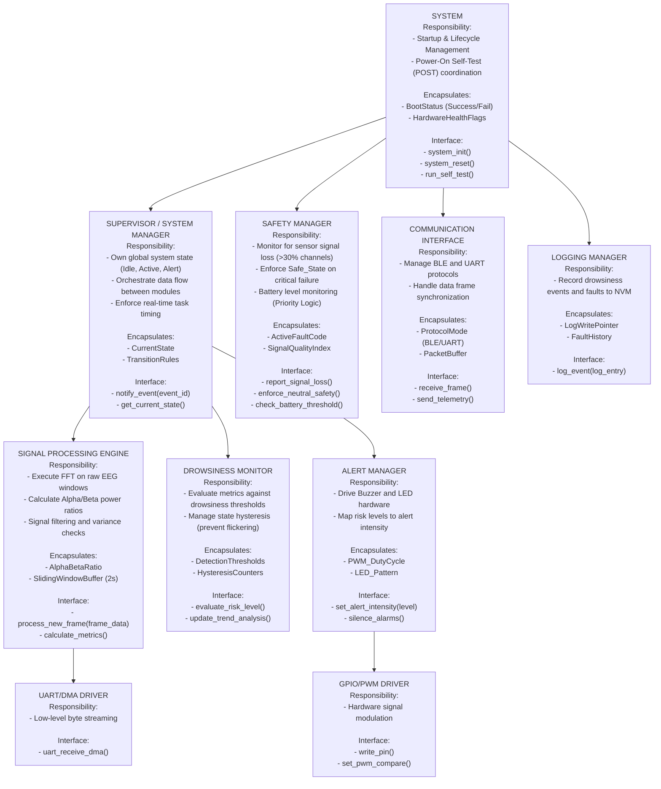

## Hierarchy of Control Diagram

---

## Dependency Constraints

**Allowed:**
- **Comms → Supervisor:** Notify when a valid frame window is ready.
- **Supervisor → Processing:** Command to update metrics.
- **Supervisor → Safety:** Report initialization success.
- **Monitor → Supervisor (via event):** Signal threshold crossing for state change.
- **AlertSystem → Drivers:** Hardware PWM/GPIO control.
- **All modules → Logger:** One-way logging of status and errors.

**Forbidden:**
- **Drivers calling upward:** Hardware interrupts must signal the Supervisor/Comms via flags or queues; they must not trigger high-level logic directly.
- **Logger influencing control:** Logging must be a non-blocking observer to prevent "logging-induced" latency.
- **Safety depending on UI:** Signal loss logic must function independently, even if the Touch Interface (UI) hangs.
- **Processing directly accessing AlertSystem:** All alerts must be mediated by the Supervisor/Monitor state to ensure centralized control.

**Global State Policy:**
- **Centralized Ownership:** Only the **Supervisor** owns the CurrentState variable (Idle, Active, Mild_Alert, High_Alert, Fault).
- **Data Encapsulation:** No shared mutable globals. Data passing (e.g., EEG frames) occurs via pointers to specific buffers managed by the Supervisor.
---

## Behavioral Mapping

| Module | Related States | Related Transitions | Related Sequence Diagrams |
| :--- | :--- | :--- | :--- |
| **Supervisor** | Idle, Active, Alert, Fault | All state changes | SD-1, SD-2, SD-3, SD-4 |
| **Safety** | Fault, Safe | SignalLoss (>30%), BatteryLow | SD-3 |
| **Processing** | Active | WindowUpdate (500ms) | SD-2 |
| **Monitor** | Mild_Alert, High_Alert | Metric > Threshold | SD-2, SD-3 |
| **Comms** | Idle, Active | FrameReceived | SD-2 |
| **AlertSystem** | Mild_Alert, High_Alert | Buzzer/LED Activation | SD-2, SD-3 |
---

## Interaction Summary

| Module | Calls | Called By | Shared Data? |
| :--- | :--- | :--- | :--- |
| **Supervisor** | Processing, Monitor | Comms, Safety | No |
| **Safety** | Supervisor, AlertSystem | System, Monitor | No |
| **Processing** | Comms (Data) | Supervisor | Yes (EEG Frames) |
| **Monitor** | AlertSystem, Safety | Supervisor | Yes (Metrics) |
| **Logger** | NVM Drivers | All | No |
| **Comms** | UART/BLE HAL | System | Yes (Raw Buffer) |
---

## Architectural Rationale

### Organizational Style: Coordinated Controllers
The architecture utilizes a **Coordinated Controller** model to satisfy stringent timing (FR-1) and safety (NFR-R1) requirements.

- **Centralized Control:** A dedicated **Supervisor** ensures that transitions from Idle to Active only occur when the Touch Interface validates user intent (UC-02).
- **Decoupled Safety:** The **Safety Manager** is separated from the normal data pipeline. This ensures that if the FFT processing (NFR-T1) hangs, the Safety Manager can still trigger a Safe_State or handle battery emergencies independently.
- **Stateless Alerting:** Following NFR-U1, the **Alert System** is driven by current risk levels determined by the Monitor, ensuring immediate response without internal dependency on previous states.

Safety logic is separated from normal control so that faults can override operation without depending on UI or logging.

---

## Task Split

| Member | Module(s) Owned | Responsibilities |
| :--- | :--- | :--- |
| **Manmay Maheshwari** | Supervisor | FSM Management, SD-1 Startup logic, SD-4 Recovery logic. |
| **Niket Sah** | Safety Manager | Signal integrity (FR-4), Battery Priority (FR-9), SD-3 safety logic. |
| **Parth Duta** | Processing Engine | FFT Computation (NFR-T1), Alpha/Beta math (FR-5). |
| **Subham Mishra** | Drowsiness Monitor | Thresholding logic, Hysteresis, Trend Analysis (FR-6). |
| **Subham Mishra** | Comms + AlertMgr | UART/BLE Drivers (FR-1/2), PWM/LED control, Logger implementation. |

---

## Individual Module Specification

## Step 8 – Individual Module Specifications

### 7.1 Supervisor (Manmay Maheshwari)

#### Purpose and Responsibilities
Maintain the global system state and orchestrate transitions between modes based on driver interaction and system health.

#### Inputs
- Touch interrupts (STMPE811)
- Fault events from Safety Manager
- Initialization status from Drivers

#### Outputs
- State change notifications to all modules
- Commands to Signal Processing (Start/Stop)

#### Internal State
- **CurrentState**: Initializing, Self_Test, Idle, Active, Fault, Safe.
- **TransitionTable**: Validates path from Idle to Active via touch release.

#### Initialization / Deinitialization
- **Init**: Execute system_init(), transition to Initializing then Self_Test.
- **Reset**: Trigger system_reset(), enter Safe state, then re-run Self_Test.

#### Basic Protection Rules
- Reject transition to Active if POST flags (Power-On Self-Test) are not cleared.
- Safe state must be reachable from any operational state upon fault detection.

#### Module-Level Tests

| Test ID | Purpose | Stimulus | Expected Outcome |
|:---|:---|:---|:---|
| **T-A1** | Startup Sequence | Power Applied | Init → Self_Test → Idle |
| **T-A2** | Guarded Transition | Start command while Fault active | Transition Rejected |

---
### 7.2 Safety Manager (Niket Sah)

#### Purpose and Responsibilities
Monitor signal quality, battery levels, and hardware heartbeats to enforce a safe state during failures.

#### Inputs
- Signal Quality Index (from Comms)
- Battery Voltage (ADC)
- Watchdog Heartbeat

#### Outputs
- Emergency Fault events to Supervisor
- Power Throttling commands to Comms (BLE disable)

#### Internal State
- **ActiveFaultCode**
- **BatteryLevel**

#### Initialization / Deinitialization
- **Init**: Start hardware watchdog timer and register ADC interrupts.
- **Reset**: Clear fault registers and neutralize alarm outputs.

#### Basic Protection Rules
- **Priority Logic**: If Battery < 10%, prioritize alarm task over BLE (FR-9).
- **Signal Guard**: Transition to Fault if signal loss exceeds 2 seconds (FR-4).

#### Module-Level Tests

| Test ID | Purpose | Stimulus | Expected Outcome |
|:---|:---|:---|:---|
| **T-B1** | Battery Priority | Simulate Battery < 10% | BLE Disabled; Alarm Active |
| **T-B2** | Signal Loss | Simulate >30% channel loss | Fault Event Triggered |

---

### 7.3 Signal Processing Engine (Parth Duta)

#### Purpose and Responsibilities
Perform mathematical transformations on EEG data to calculate metrics required for drowsiness detection.

#### Inputs
- Raw EEG Data Frames (via UART/DMA)
- Processing Start/Stop commands

#### Outputs
- Alpha/Beta Power Ratios
- Signal Variance metrics

#### Internal State
- **SlidingWindowBuffer**: 2-second history.
- **FFT_Configuration**

#### Initialization / Deinitialization
- **Init**: Configure FPU (Floating Point Unit) and initialize CMSIS-DSP FFT tables.
- **Reset**: Flush all EEG buffers and reset sliding window pointers.

#### Basic Protection Rules
- **WCET Guarantee**: Logic must complete within 50ms to prevent buffer overflow (NFR-T1).
- Reject input frames if checksum or data integrity fails.

#### Module-Level Tests

| Test ID | Purpose | Stimulus | Expected Outcome |
|:---|:---|:---|:---|
| **T-C1** | Windowing Timing | 500ms Timer Tick | Metrics updated every 500ms |
| **T-C2** | Math Robustness | Zero-value EEG frame | Calculation returns safe error code |

---

### 7.4 Drowsiness Monitor (Subham Mishra)

#### Purpose and Responsibilities
Evaluate metrics against thresholds and manage the persistence logic for escalating alerts.

#### Inputs
- Alpha/Beta Ratios (from Processing)
- Signal Variance (from Processing)

#### Outputs
- Risk Level Events (Mild, High)
- Escalation notifications to Alert System

#### Internal State
- **ThresholdTable**
- **EscalationTimer**: 10-second persistence counter.

#### Initialization / Deinitialization
- **Init**: Load threshold values from NVM (Non-Volatile Memory).
- **Reset**: Reset escalation timers and clear trend history.

#### Basic Protection Rules
- **Hysteresis**: Implement a dead-band to prevent rapid alert toggling (flickering).
- **Stateless Alerting**: Alert level must be based on current risk, independent of previous history (NFR-U1).

#### Module-Level Tests

| Test ID | Purpose | Stimulus | Expected Outcome |
|:---|:---|:---|:---|
| **T-D1** | Threshold Trigger | Ratio > Threshold 1 | Notify Mild_Alert |
| **T-D2** | Persistence | High Ratio for 11 seconds | Notify High_Alert |

---

### 7.5 Comms & Alert Interface (Subham Mishra)

#### Purpose and Responsibilities
Manage low-level drivers for data ingestion (UART/BLE) and hardware actuation (Buzzer/LED).

#### Inputs
- Commands from Supervisor (Alert Level)
- Telemetry data for logging

#### Outputs
- PWM signals to Buzzer
- GPIO signals to LEDs
- Log strings to UART/NVM

#### Internal State
- **UART_DMA_Config**
- **PWM_DutyCycle**

#### Initialization / Deinitialization
- **Init**: Initialize UART (DMA mode), I2C for touch interface, and PWM timers.
- **Reset**: Set all PWM duty cycles to 0% and clear DMA pointers.

#### Basic Protection Rules
- **Non-blocking Logging**: Logger must not stall the control loop.
- **Input Decoupling**: UART reception must use DMA to prevent data loss during processing (FR-1).

#### Module-Level Tests

| Test ID | Purpose | Stimulus | Expected Outcome |
|:---|:---|:---|:---|
| **T-E1** | Alert Latency | High_Alert command | Buzzer active within 200ms |
| **T-E2** | Frame Reception | Incoming UART stream | DMA buffer filled without CPU load |

---

## Architectural Risk

### Identified Risk: Resistive Touchscreen Ghost Inputs & Interrupt Flooding
The 4-wire resistive touchscreen on the Embedded Hardware(STM32F429I-DISC1) can degrade over prolonged usage, causing unintended “ghost touches” or a permanently asserted press signal.
If the Touch Interface module generates frequent false interrupts, it may introduce computational jitter in the Signal Processing and Comms tasks. This can result in:
- UART buffer overruns or dropped bytes
- Increased interrupt latency during EEG acquisition
- Unintended state transitions (e.g., false start/stop recording events)
- Delayed or incorrect Alert triggering
In a safety-critical EEG Drowsiness Detection system, such jitter could compromise timing guarantees (e.g., 500 ms alert constraint), making this a potential reliability and integrity risk.
---

### Mitigation
- **Input Validation & Debouncing:** Accept touch events only if pressure and coordinates remain stable for a defined threshold period, filtering out transient ghost signals.
- **Interrupt Rate Limiting:** Throttle touch interrupts or poll at controlled intervals to prevent ISR flooding.
- **Priority-Based Scheduling:** Assign higher preemption priority to EEG Sampling, Comms, and Alert tasks so that touch events cannot delay safety-critical execution.
- **DMA Offloading:** Use DMA for UART transfers to decouple communication from CPU timing, ensuring stable data flow even if touch interrupts occur.
- **Operational Isolation:** Disable or logically ignore the touchscreen during active EEG acquisition phases if it is not essential to runtime control.
